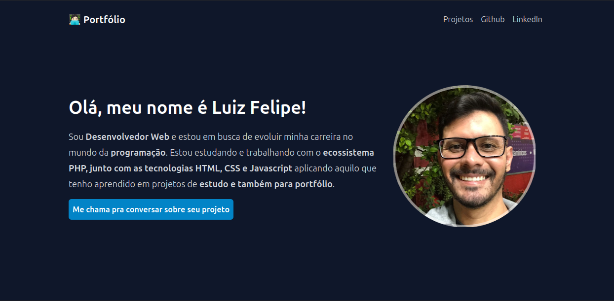

# 🌐 Portfólio

Bem-vindo ao meu portfólio! 
 
Este projeto tem como objetivo apresentar meus conhecimentos em desenvolvimento web.

## 📷 Screenshot do Portfólio 

## ✨ Sobre o Projeto

Desenvolvido durante a formação PHP da Rocketseat  *junto ao instrutor*.

- 📌 Foi desenvolvido para mostrar os projetos para portfólio
- 🧠 Compartilhar um pouco sobre o desenvolvedor
- 🌐 Mostrar os links das redes como Github e LinkedIn

## 🚀 Tecnologias Utilizadas

- HTML5
- CSS3
- Tailwindcss
- PHP *(para funcionalidades básicas no backend)* 

